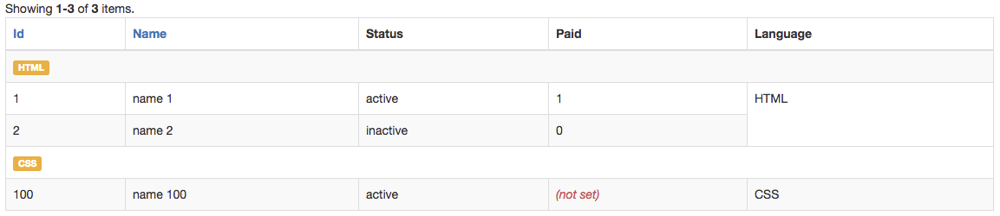

GroupColumnsBehavior
====================

This behavior proves how you can override the grid's methods without the need to override the GridView class directly. 
Is a ported version of the old `GroupGridView` widget that was previously on this library. 

It overrides the `renderItems()` method of the `GridView` widget, so the token is already on its layout template: 
`{items}`. 

> Do not get confused by the simplicity what has been just said, this mechanism that is provided by the GridView is very 
> powerful. It grants you total control of our grid library, adding as many enhancements throughout behaviors as you 
> wish even wrapping entirely the grid API itself.

### Usage 

**Group Columns** 

```php

use dosamigos\grid\GridView;
use yii\data\ArrayDataProvider;
use dosamigos\grid\behaviors\GroupColumnsBehavior;

// create test data provider
$data = [
    ['id' => 1, 'name' => 'name 1', 'status' => 'active', 'paid' => 1, 'language' => 'HTML'],
    ['id' => 2, 'name' => 'name 2', 'status' => 'inactive', 'paid' => 0, 'language' => 'HTML'],
    ['id' => 100, 'name' => 'name 100', 'status' => 'active', 'paid' => null, 'language' => 'CSS'],
];

$provider = new ArrayDataProvider([
    'allModels' => $data,
    'pagination' => [
        'pageSize' => 10,
    ],
    'sort' => [
        'attributes' => ['id', 'name'],
    ],
]);

// display grid
echo GridView::widget(
    [
        'behaviors' => [
            [
                'class' => 'GroupColumnsBehavior',
                // You an use multiple columns for extra row but remember that will affect the merging
                // as both columns must be having same values for the extra row to title the records 
                'extraRowColumns' => ['language'],
                // you can use multiple columns here 
                'mergeColumns' => ['language'] 
            ]

        ],
        'dataProvider' => $provider,
        'layout' => "{summary}\n{items}\n{pager}"
    ]
);

```

The above would display: 



**Format Extra Row**

The behavior has an attribute that allows you to render the extra row contents as you please: 

```php

use dosamigos\grid\GridView;
use yii\data\ArrayDataProvider;
use dosamigos\grid\behaviors\GroupColumnsBehavior;

// create test data provider
$data = [
    ['id' => 1, 'name' => 'name 1', 'status' => 'active', 'paid' => 1, 'language' => 'HTML'],
    ['id' => 2, 'name' => 'name 2', 'status' => 'inactive', 'paid' => 0, 'language' => 'HTML'],
    ['id' => 100, 'name' => 'name 100', 'status' => 'active', 'paid' => null, 'language' => 'CSS'],
];

$provider = new ArrayDataProvider([
    'allModels' => $data,
    'pagination' => [
        'pageSize' => 10,
    ],
    'sort' => [
        'attributes' => ['id', 'name'],
    ],
]);

// display grid
echo GridView::widget(
    [
        'behaviors' => [
            [
                'class' => 'GroupColumnsBehavior', 
                'extraRowColumns' => ['language'],
                'extraRowValue' => function($model, $key, $index, $totals) {
                    return '<span class="label label-warning">' . $model['language'] . '</span>';
                },
                'mergeColumns' => ['language'] 
            ]

        ],
        'dataProvider' => $provider,
        'layout' => "{summary}\n{items}\n{pager}"
    ]
);

```

We highly recommend you to check its source code and see how this behavior manages to wrap GridView's methods.


© [2amigos](http://www.2amigos.us/) 2013-2017
