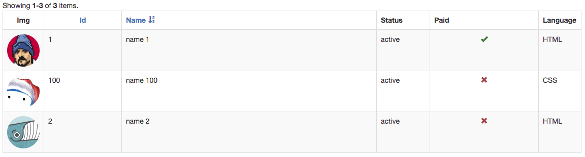

BooleanColumn
=============

It extends from `dosamigos\grid\DataColumn` and automatically converts boolean values to a more user friendly 
configurable content (i.e. icons or text labels).

> **Note** The main objective of this library is `simplicity`, so this column does simply what it states and nothing 
> more. It extends from our DataColumn so its headers can be rowspan when not using filters. This column can be used 
> on any `yii\grid\GridView` widget. 


### Usage

** Display boolean columns treating empty as false boolean** 

```php
    'columns' => [
        // ... other columns ... 
        [
            'class' => '\dosamigos\grid\columns\BooleanColumn',
            'attribute' => 'paid',
            'treatEmptyAsFalse' => true
        ],
        'language'
    ],
    // ... other grid view configuration
```

The above would display




© [2amigos](http://www.2amigos.us/) 2013-2017
