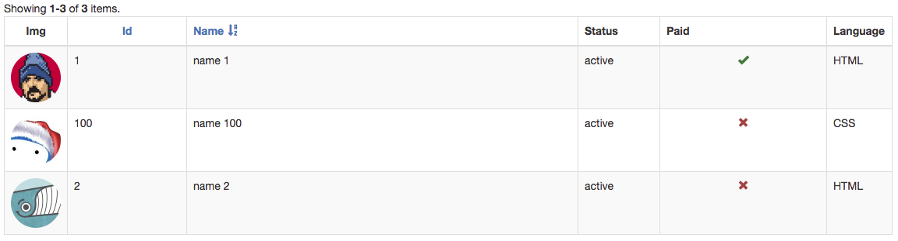

ImageColumn
===========

This column assumes that the value of the model is an image url and it displays an image tag. We liked configuration 
over callbacks as it made more sense to us to make it portable than to repeat logic within callbacks on each one of our 
projects. 


### Usage 

```php 
'columns' => [
    [
        'class' => '\dosamigos\grid\columns\ImageColumn',
        'attribute' => 'img',
        'imgOptions' => [
            'class' => 'img-responsive img-circle',
            'width' => '128'
        ],
        'contentOptions' => [
            'class' => 'text-center'
        ],
        'rowSpanNoFilterHeaders' => true,
        'headerOptions' => [
            'style' => 'text-align: center !important;vertical-align: middle !important'
        ]
    ],
    // ... other columns 
```

The above would display




© [2amigos](http://www.2amigos.us/) 2013-2017
