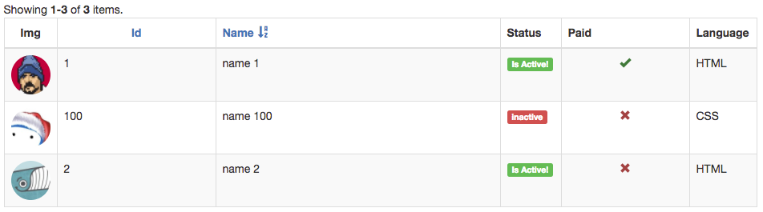

LabelColumn
===========

The label column provides a way to display the value of the column within bootstrap labels. It is very useful when you 
wish to provide a colored visual feedback on the different states of a record.  

###Usage 

```php 
'columns' => [
    [
        'class' => '\dosamigos\grid\columns\LabelColumn',
        'attribute' => 'status',
        'labels' => [
            'active' => [ // keys represent the value of the model
                'label' => 'Is Active!',
                'options' => [
                    'class' => 'label-success'
                ]
            ],
            'inactive' => [ // the key will be used as label text
                'options' => [
                    'class' => 'label-danger'
                ]
            ]
        ]
    ],
    // ... other columns
```

The above would display the status column like the following 

The above would display




© [2amigos](http://www.2amigos.us/) 2013-2017
